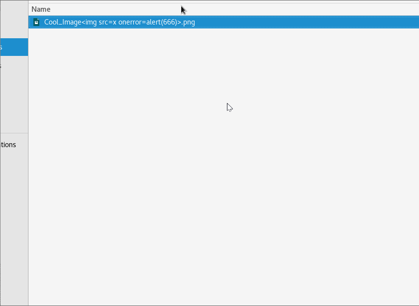
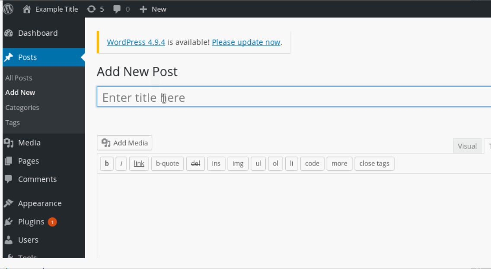
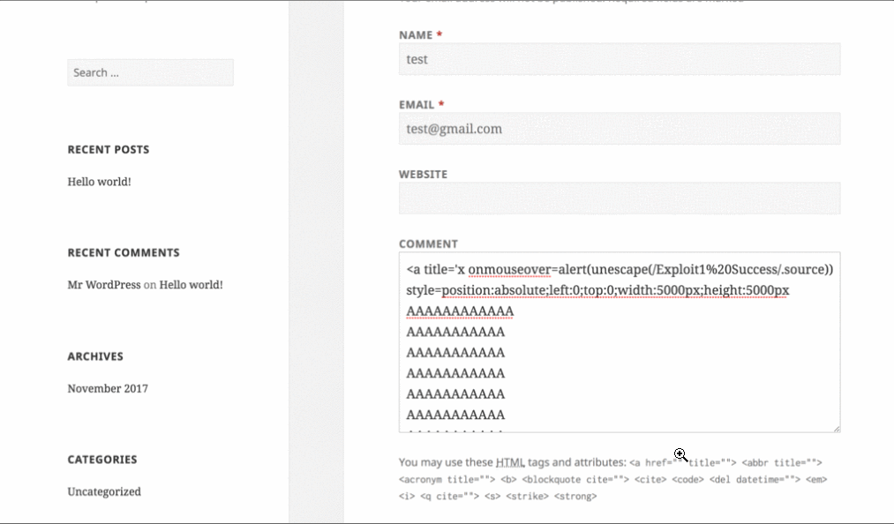

# Web-Security-Week-7
This is the Week 7 and Week 8 assignment write up for the Web Security course by CodePath.
# Project 7 - WordPress Pentesting

Time spent: **10** hours spent in total

> Objective: Find, analyze, recreate, and document **at least three and up to five vulnerabilties** affecting an old version of WordPress

## Pentesting Report

1. XSS:Through the filename of an iamge
  - [ ] Summary: 
    - Vulnerability types: Cross-Site Scripting(XSS) 
    - Tested in version: 4.2
    - Fixed in version: 4.2.10
  - [ ] GIF Walkthrough: 
  - [ ] Steps to recreate: 
        1. Create a file with this format: file_name<JavaScript_Code>
        2. Make sure that the size of the file is at least 2 MB
        3. Create a new media file and after uploading, press update
        4. There will be an error message of the image being too large and the JavaScript Code will execute.

2. XSS:Through authentication in a new post
  - [ ] Summary: 
    - Vulnerability types: Cross-Site Scripting(XSS)
    - Tested in version: 4.2.0
    - Fixed in version: 4.2.13
  - [ ] GIF Walkthrough: 
  - [ ] Steps to recreate: 
         1. First make a new post as an admin
         2. <a onmouseover="alert('I got you!')"> click here </a>
         3. Save changes and click view post and then the alert will pop up saying "I got you!"

3. (Required) Unauthenticated Stores XSS
  - [ ] Summary: 
    - Vulnerability types:Cross-Site Scripting (XSS)
    - Tested in version: 4.2
    - Fixed in version:  4.2.1
  - [ ] GIF Walkthrough: 
  - [ ] Steps to recreate: 
        1. Go to wordpress and paste this link in the comment box and post
        2. <a title='x onmouseover=alert(unescape(/Exploit1%20Sucess/.source)) style=position:absolute;left:0;top:0;width:5000px;height:5000px
AAAAAAAAAAA
AAAAAAA
AAAAAAAA
AAAAAA
...
</a>

## Assets

No scripts or files needed

## Resources

- [WordPress Source Browser](https://core.trac.wordpress.org/browser/)
- [WordPress Developer Reference](https://developer.wordpress.org/reference/)

GIFs created with [LiceCap](http://www.cockos.com/licecap/).

## Notes

No real challenges, just the whole setup process of vagrant, WPDistillery and kali linux was a bit hectic.

## License

    Copyright [2020] [Farhan Zaman]

    Licensed under the Apache License, Version 2.0 (the "License");
    you may not use this file except in compliance with the License.
    You may obtain a copy of the License at

        http://www.apache.org/licenses/LICENSE-2.0

    Unless required by applicable law or agreed to in writing, software
    distributed under the License is distributed on an "AS IS" BASIS,
    WITHOUT WARRANTIES OR CONDITIONS OF ANY KIND, either express or implied.
    See the License for the specific language governing permissions and
    limitations under the License.
